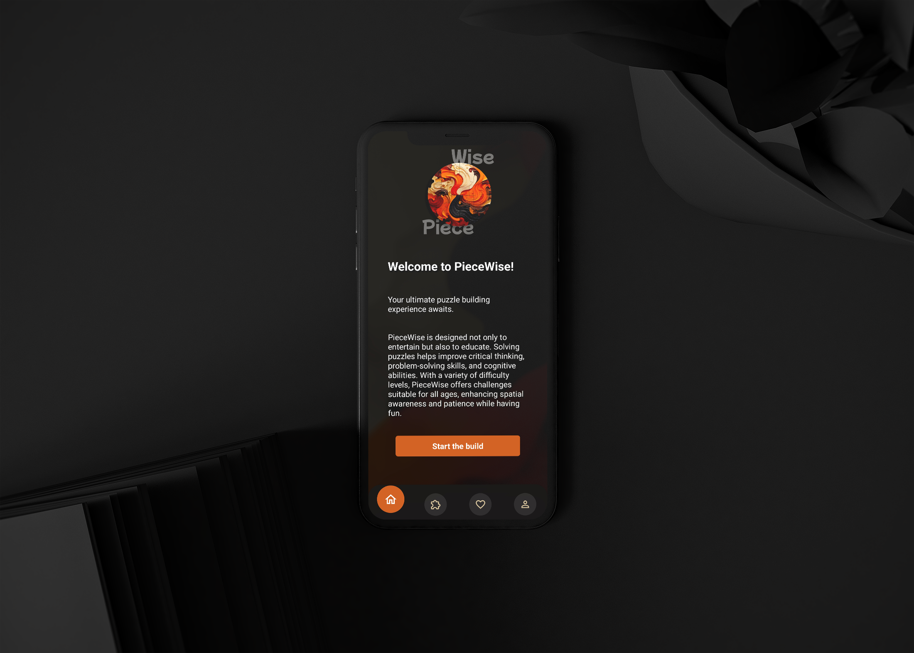

<div align="center">
  <h1 style="font-size: 48px; font-weight: bold; color: #CE662A;">WisePiece</h1>
</div>

<div align="center">
  
</div>

WisePiece is a mobile application designed for puzzle enthusiasts. It allows users to solve puzzles, save their progress, and manage their favorite puzzles. The app features a user-friendly interface, various difficulty levels, and the ability to analyze completed puzzles using AI.

## Table of Contents
- [Overview](#overview)
- [Technologies and Libraries Used](#technologies-and-libraries-used)
- [APIs Used](#apis-used)
- [Installation](#installation)
- [Prerequisites](#prerequisites)
- [Environment Setup](#environment-setup)
- [Directory Structure](#directory-structure)
- [Features](#features)
- [Features in Progress](#features-in-progress)
- [Mockups](#mockups)
- [Usage](#usage)
- [Testing](#testing)
- [Deployment](#deployment)
- [Troubleshooting](#troubleshooting)
- [Contributing](#contributing)
- [License](#license)
- [Acknowledgments](#acknowledgments)
- [Contact](#contact)

## Overview
WisePiece is a mobile app designed to provide an engaging puzzle-solving experience. Users can solve puzzles, upload images, and even analyze completed puzzles using AI technology. It supports different difficulty levels and allows users to save and revisit their favorite puzzles.

## Technologies and Libraries Used
- **React Native**: For building the mobile application.
- **Expo**: For easy development and deployment.
- **Firebase**: For user authentication and data storage.
- **Axios**: For making HTTP requests.
- **React Navigation**: For seamless navigation between screens.
- **React Native Vector Icons**: For using icons in the app.
- **React Native Elements**: For UI components.
- **Expo Image Picker**: For selecting images from the device.

## APIs Used
- **Wikipedia API**: To fetch summaries and information related to puzzles and images.
  - Endpoint: `https://en.wikipedia.org/api/rest_v1/page/summary/{query}`
- **Google Vision API**: To analyze images and detect web entities.
  - Endpoint: `https://vision.googleapis.com/v1/images:annotate?key={YOUR_API_KEY}`

## Prerequisites
- Node.js (v22.11.0 or above)
- npm or yarn
- Expo CLI

## Installation
1. Clone the repository:
   ```bash
   git clone https://github.com/yourusername/wisepiece.git
   ```
2. Navigate to the project directory:
   ```bash
   cd wisepiece
   ```
3. Install dependencies:
   ```bash
   npm install
   ```
4. Start the development server:
   ```bash
   npm start
   ```
5. Open the app on your device or emulator.

## Environment Setup
Create a `.env` file in the root directory and add your Firebase and Google Vision API keys:
```env
FIREBASE_API_KEY=your_firebase_api_key
GOOGLE_VISION_API_KEY=your_google_vision_api_key
```
Make sure to include a `.env.example` file to help others set up the environment variables correctly.

## Directory Structure
```
- assets/           # Images and other assets
- components/       # Reusable React Native components
- screens/          # Main screens of the application
- navigation/       # Navigation configuration
- services/         # Firebase and API-related services
- utils/            # Utility functions
- App.tsx           # Main entry point
```

## Features
- **User Authentication**: Sign up and log in to manage your puzzles.
- **Puzzle Solving**: Dynamically generated puzzles based on selected images and difficulty levels.
- **Favorites**: Save your favorite puzzles for easy access.
- **Completed Puzzles**: Track your completed puzzles and analyze them for insights.
- **Web Detection**: Analyze completed puzzles to fetch related information from the web.
- **Image Upload**: Users can upload their own images to create custom puzzles.
- **Difficulty Levels**: Choose from various difficulty levels to match your skill.

## Features in Progress
- **Leaderboard**: Track and compare progress with other users.
- **Social Sharing**: Share completed puzzles on social media.
- **Achievements**: Unlock badges based on puzzle-solving milestones.

## Mockups
<div align="center">
  
  
  
</div>

## Usage
- **Sign Up / Log In**: Create an account or log in to access your puzzles.
- **Puzzle Selection**: Choose a puzzle from the available options.
- **Solving Puzzles**: Drag and drop pieces to solve the puzzle.
- **Analyze Completed Puzzles**: Use the analyze feature to get insights about your completed puzzles.

## Testing
To run the tests for this project:
```bash
npm test
```
Ensure that you have set up all environment variables before running tests.

## Troubleshooting
- **Issue**: Firebase native module missing.
  - **Solution**: Run `npx expo install @react-native-firebase/app` and make sure the correct versions are installed.

## Contributing
Contributions are welcome! Please follow these steps:
1. Fork the repository.
2. Create a new branch (`git checkout -b feature/YourFeature`).
3. Make your changes and commit them (`git commit -m 'Add some feature'`).
4. Push to the branch (`git push origin feature/YourFeature`).
5. Create a new Pull Request.

## Acknowledgments
- Thanks to the React Native community for their support and resources.
- Special thanks to the contributors who have helped improve this project.

## Contact
- Maintainer: [Dante CS Strijdom](mailto: cs.dantestrijdom@gmailcom)
- GitHub: [https://github.com/DanteCS25](https://github.com/DanteCS25)
